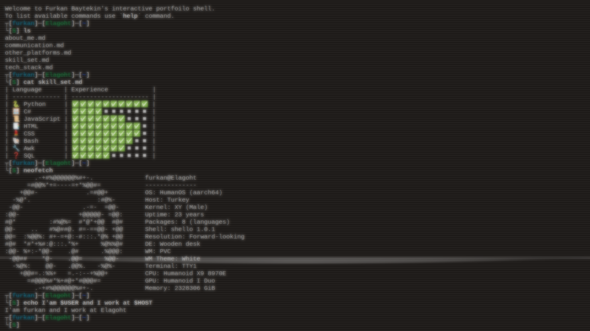

# Terminal Protfolio

My personal terminal portfolio page that I created with pure Vanilla JavaScript and Tailwind CSS. Licensed Under GPLv3. You can use source code to produce your own. Do not forget to give credits.

Prompt theme in the site is [Elagoht-safe.zsh-theme](https://github.com/Elagoht/Elagoht.zsh-theme) and actually made for [oh-my-zsh](https://ohmyz.sh) framework.

## Screenshots

